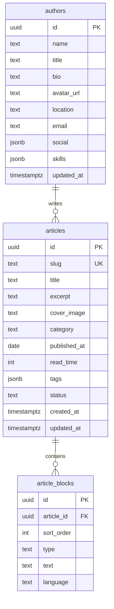

# PRD：博客内容 Supabase 全量存储

| 项目 | 说明 |
|------|------|
| 文档版本 | v1.0 |
| 创建日期 | 2026-06-20 |
| 产品名称 | Next.js 个人博客 — Supabase 数据层 |
| Supabase 项目 | `qjprpazkitowbhxxvfam` |
| 状态 | 待开发 |
| 前置文档 | [PRD-article-management.md](./PRD-article-management.md) |

---

## 1. 背景与目标

### 1.1 背景

当前博客数据分散在本地文件系统中：

| 数据 | 当前存储 | 问题 |
|------|----------|------|
| 文章 | `data/articles.json` | 无法部署到 Vercel 等无持久化磁盘环境 |
| 作者资料 | `data/author.json` | 同上 |
| 头像 | `public/images/avatar.jpg` | 随部署丢失，无法 CDN 加速 |
| 封面图 | Unsplash URL 字符串 | 未统一管理，无法本地上传 |

Supabase 项目 `qjprpazkitowbhxxvfam` 的 `public` schema **当前为空**，适合从零设计表结构。

### 1.2 目标

1. **所有业务内容写入 Supabase**：文章、作者、标签、正文块、封面、头像。
2. **发布即入库**：作者在管理页点击「发布」后，数据持久化到 Postgres；前台只展示已发布内容。
3. **可云端部署**：去掉对本地 JSON / `public/` 写入的依赖，支持 Vercel 一键部署。
4. **保留现有 UI 与交互**：管理页、侧滑编辑器、内容块类型不变，仅替换数据层。

### 1.3 非目标（本期不做）

- 多作者 / 多租户
- 评论、点赞（前台展示数据可继续用 mock 统计）
- Markdown 导入导出
- 富文本 WYSIWYG
- 全文搜索（Elasticsearch / pg_search）
- 版本历史 / 文章修订记录

---

## 2. 用户角色

| 角色 | 描述 | 权限 |
|------|------|------|
| 读者 | 浏览博客 | 只读已发布文章与作者公开资料 |
| 作者（管理员） | 站点所有者 | 登录后可创建/编辑/发布/删除文章，修改资料与上传图片 |

---

## 3. 用户故事

| ID | 用户故事 | 优先级 |
|----|----------|--------|
| US-01 | 作为作者，我希望新建文章保存为草稿到 Supabase，以便随时继续编辑 | P0 |
| US-02 | 作为作者，我希望点击「发布」后文章写入数据库并出现在前台 | P0 |
| US-03 | 作为作者，我希望编辑/删除已发布文章，变更立即同步到 Supabase | P0 |
| US-04 | 作为作者，我希望上传头像与文章封面到 Supabase Storage | P0 |
| US-05 | 作为作者，我希望在管理页看到草稿与已发布状态 | P0 |
| US-06 | 作为作者，我希望编辑个人资料并保存到 Supabase | P0 |
| US-07 | 作为读者，我只能看到 `published` 状态的文章 | P0 |
| US-08 | 作为作者，我希望把现有 `articles.json` / `author.json` 一次性迁移到 Supabase | P1 |
| US-09 | 作为作者，我希望管理页需要登录才能访问 | P1 |

---

## 4. 功能需求

### 4.1 文章发布流程（核心）

```
管理页 → 新建/编辑 → 保存草稿（status=draft）→ Supabase INSERT/UPDATE
       → 点击「发布」（status=published, published_at=now）→ 前台可见
       → 点击「下架」（status=draft）→ 前台不可见，数据仍保留
```

**规则：**

- 「保存草稿」：校验 slug 唯一、标题非空；`status = draft`；不要求摘要完整。
- 「发布」：完整校验（与现有 `validateArticle` 一致）；`status = published`；`published_at` 默认当天（可选手动指定）。
- 已发布文章编辑后再次「发布」：UPDATE 同一条记录（按 `id` 或 `slug`）。
- 删除：物理删除或软删除（本期采用 **物理删除**）。

### 4.2 前台读取

- 首页、列表页、详情页：仅查询 `status = 'published'`。
- 管理页：查询全部状态，按 `updated_at DESC`。
- 作者信息：读取 `authors` 表单行（博客仅一条记录）。

### 4.3 媒体资源

| 类型 | Storage Bucket | 路径规范 | 访问 |
|------|----------------|----------|------|
| 头像 | `avatars` | `{user_id}/avatar.jpg` | Public |
| 文章封面 | `covers` | `{article_id}/cover.{ext}` | Public |

- 上传后 URL 存入数据库 `avatar_url` / `cover_image`。
- 保留 Unsplash 外链作为默认值；本地上传后替换为 Storage 公开 URL。

### 4.4 管理页改造

在现有 `ArticleEditorPanel` 上增加：

- 状态 Badge：`草稿` / `已发布`
- 按钮：**保存草稿** | **发布** | **下架**（已发布时）
- 封面图上传（Ant Design Upload → Storage）

### 4.5 API 改造原则

- **读操作**：Server Component / Route Handler 通过 `@/lib/supabase/server` 查询。
- **写操作**：必须经 **已登录管理员** 或 **Service Role（仅服务端）** 执行，禁止匿名客户端直写。
- 逐步废弃：`data/articles.json`、`data/author.json`、本地头像写入。

---

## 5. 数据库设计

### 5.1 ER 关系



> **说明：** 正文块采用 **独立表** `article_blocks`（便于排序与后续扩展）；若希望快速落地，也可将 `content` 存为 `articles.content jsonb`，与现有 TypeScript 类型一致。下文 SQL 采用 **jsonb 方案**（改动最小）。

### 5.2 表结构 SQL（Migration v1）

```sql
-- 作者（单博客单行，id 固定或使用 uuid）
create table public.authors (
  id uuid primary key default gen_random_uuid(),
  name text not null,
  title text not null,
  bio text not null,
  avatar_url text not null default '',
  location text not null default '',
  email text not null default '',
  social jsonb not null default '{}'::jsonb,
  skills jsonb not null default '[]'::jsonb,
  updated_at timestamptz not null default now()
);

-- 文章
create type public.article_status as enum ('draft', 'published');

create table public.articles (
  id uuid primary key default gen_random_uuid(),
  slug text not null unique,
  title text not null,
  excerpt text not null default '',
  cover_image text not null default '',
  category text not null default '',
  published_at date,
  read_time int not null default 1,
  tags jsonb not null default '[]'::jsonb,
  content jsonb not null default '[]'::jsonb,
  status public.article_status not null default 'draft',
  created_at timestamptz not null default now(),
  updated_at timestamptz not null default now()
);

create index articles_status_published_at_idx
  on public.articles (status, published_at desc);

create index articles_updated_at_idx
  on public.articles (updated_at desc);

-- updated_at 自动刷新
create or replace function public.set_updated_at()
returns trigger language plpgsql as $$
begin
  new.updated_at = now();
  return new;
end;
$$;

create trigger articles_set_updated_at
  before update on public.articles
  for each row execute function public.set_updated_at();

create trigger authors_set_updated_at
  before update on public.authors
  for each row execute function public.set_updated_at();
```

### 5.3 TypeScript 映射

| 现有类型 | Supabase 列 | 备注 |
|----------|-------------|------|
| `Author` | `authors.*` | `social`、`skills` 用 jsonb |
| `ArticleSummary` | `articles` 除 `content` | 列表不查 content |
| `Article.content` | `articles.content` | jsonb 数组 |
| — | `articles.status` | 新增：`draft` \| `published` |
| — | `articles.id` | 新增 uuid，slug 仍用于 URL |

---

## 6. Storage 设计

```sql
-- buckets（通过 Dashboard 或 migration）
-- avatars: public, 5MB, image/*
-- covers:  public, 5MB, image/*
```

| Bucket | 公开读 | 写入权限 |
|--------|--------|----------|
| `avatars` | 是 | 仅 authenticated 管理员 |
| `covers` | 是 | 仅 authenticated 管理员 |

---

## 7. 权限与安全（RLS）

### 7.1 认证方案（推荐）

| 方案 | 说明 | 推荐 |
|------|------|------|
| A. Supabase Auth 邮箱登录 | 管理页登录，RLS 绑定 `auth.uid()` | ✅ 推荐 |
| B. Service Role 仅服务端 | API Route 用 `SUPABASE_SERVICE_ROLE_KEY`，管理页无登录 | 备选（安全性较弱） |

**推荐方案 A：**

1. 在 Supabase Auth 创建管理员账号（邮箱 + 密码）。
2. `authors.admin_user_id uuid references auth.users(id)` 可选，用于 RLS 校验。
3. 管理页 `/articles/manage` 增加登录门禁（未登录跳转 `/login`）。

### 7.2 RLS 策略

```sql
alter table public.authors enable row level security;
alter table public.articles enable row level security;

-- 读者：只读作者
create policy "authors_public_read"
  on public.authors for select
  using (true);

-- 读者：只读已发布文章
create policy "articles_public_read"
  on public.articles for select
  using (status = 'published');

-- 管理员：全部文章 CRUD（需 authenticated）
create policy "articles_admin_all"
  on public.articles for all
  to authenticated
  using (true)
  with check (true);

-- 管理员：作者资料更新
create policy "authors_admin_write"
  on public.authors for all
  to authenticated
  using (true)
  with check (true);
```

> 生产环境应将 `articles_admin_all` 收窄为 `auth.uid() = admin_user_id`，避免任意登录用户改文章。

### 7.3 环境变量

| 变量 | 用途 | 暴露 |
|------|------|------|
| `NEXT_PUBLIC_SUPABASE_URL` | 客户端/服务端 | 公开 |
| `NEXT_PUBLIC_SUPABASE_PUBLISHABLE_KEY` | 客户端/服务端 | 公开 |
| `SUPABASE_SERVICE_ROLE_KEY` | 服务端迁移脚本、可选 API | **仅服务端，禁止 NEXT_PUBLIC** |

---

## 8. 代码改造范围

### 8.1 新增文件

```
src/lib/supabase/
  client.ts          # 已有
  server.ts          # 已有
  admin.ts           # Service Role 客户端（迁移/批处理）
  types.ts           # generate_typescript_types 生成

src/lib/
  articles-supabase.ts   # CRUD 替代 articles.ts 文件读写
  author-supabase.ts     # 替代 author.ts 文件读写
  storage.ts             # 头像/封面上传

src/app/login/page.tsx   # 管理员登录（P1）
scripts/migrate-to-supabase.mjs  # JSON → Supabase 一次性迁移
```

### 8.2 修改文件

| 文件 | 改动 |
|------|------|
| `src/lib/articles.ts` | 改为调用 Supabase，或重导出 `articles-supabase.ts` |
| `src/lib/author.ts` | 改为 Supabase + Storage |
| `src/app/api/articles/*` | 写入 Supabase；发布时设 `status=published` |
| `src/app/api/author/*` | 读写 `authors` 表；头像走 Storage |
| `src/components/articles/ArticleEditorPanel.tsx` | 增加草稿/发布按钮、封面上传 |
| `.env.example` | 增加 `SUPABASE_SERVICE_ROLE_KEY` 说明 |

### 8.3 废弃（迁移完成后）

- `data/articles.json`（保留只读备份）
- `data/author.json`
- `public/images/avatar.jpg` 写入逻辑

---

## 9. API 设计（Supabase 版）

保持现有 REST 路径不变，内部实现替换：

| 方法 | 路径 | 行为变化 |
|------|------|----------|
| GET | `/api/articles` | 管理端：全部；可加 `?status=published` |
| POST | `/api/articles` | body 含 `status`；`published` 时完整校验 |
| GET | `/api/articles/[slug]` | 管理端可读草稿；前台 API 仅 published |
| PUT | `/api/articles/[slug]` | 支持改 slug（更新 unique 约束） |
| DELETE | `/api/articles/[slug]` | 从 Supabase 删除 |
| GET/PUT | `/api/author` | 读写 `authors` 表 |
| POST | `/api/author/avatar` | 上传 Storage + 更新 `avatar_url` |
| POST | `/api/articles/[slug]/cover` | **新增** 封面上传 |

**发布请求体示例：**

```json
{
  "slug": "nextjs-app-router-guide",
  "title": "Next.js App Router 完全指南",
  "excerpt": "...",
  "category": "前端开发",
  "tags": ["Next.js", "React"],
  "publishedAt": "2026-03-15",
  "readTime": 8,
  "coverImage": "https://...supabase.co/storage/v1/object/public/covers/...",
  "content": [{ "type": "paragraph", "text": "..." }],
  "status": "published"
}
```

---

## 10. 数据迁移计划

### 10.1 步骤

1. MCP / Migration 创建表、RLS、Storage buckets。
2. 运行 `scripts/migrate-to-supabase.mjs`：
   - 读取 `data/articles.json` → insert `articles`（默认 `status=published`）
   - 读取 `data/author.json` → upsert `authors` 单行
   - 上传本地头像到 `avatars` bucket（若存在）
3. 切换 `articles.ts` / `author.ts` 数据源为 Supabase。
4. 验证前台与管理页；确认 JSON 不再读写。
5. 部署到 Vercel，配置环境变量。

### 10.2 回滚

- 保留 JSON 文件备份。
- Feature flag：`USE_SUPABASE=false` 时回退本地文件（可选，仅开发期）。

---

## 11. 实施阶段

| 阶段 | 内容 | 预估 |
|------|------|------|
| **P0-1** | Supabase 建表、RLS、Storage；生成 TS 类型 | 0.5d |
| **P0-2** | `articles-supabase.ts` + API 改造；草稿/发布 | 1d |
| **P0-3** | `author-supabase.ts` + 头像 Storage | 0.5d |
| **P0-4** | 管理页 UI（发布/草稿/状态） | 0.5d |
| **P1-1** | 管理员登录 + 管理页鉴权 | 0.5d |
| **P1-2** | 数据迁移脚本 + 封面上传 | 0.5d |
| **P1-3** | 移除 JSON 依赖、更新 README | 0.5d |

**合计：约 4 个工作日**

---

## 12. 验收标准

- [ ] 新建文章「保存草稿」后，Supabase `articles` 表出现 `status=draft` 记录
- [ ] 点击「发布」后，`status=published`，前台 `/articles/[slug]` 可访问
- [ ] 草稿文章在前台列表与详情 **不可见**
- [ ] 编辑、删除、改 slug 均正确更新 Supabase
- [ ] 作者资料读写 `authors` 表，头像存 Storage 且 URL 可访问
- [ ] 本地 `data/articles.json` 不再被写入
- [ ] `npm run build` 通过；Vercel 部署后数据持久化
- [ ] RLS：匿名用户无法 INSERT/UPDATE/DELETE 文章

---

## 13. 风险与依赖

| 风险 | 缓解 |
|------|------|
| 管理页无鉴权被公开访问 | P1 登录门禁 + RLS |
| Service Role 泄露 | 仅 `.env.local` / Vercel 密钥，不进客户端 |
| slug 修改导致旧链接失效 | 编辑时提示；可选后续做 slug 重定向表 |
| 迁移重复执行 | 迁移脚本按 slug upsert |
| MCP 与项目不一致 | 以 `.env.local` 的 `project_ref` 为准 |

---

## 14. 附录：与现有 PRD 差异

| 项 | 原 PRD v1.0 | 本 PRD |
|----|-------------|--------|
| 存储 | `data/articles.json` | Supabase Postgres |
| 作者 | `data/author.json` | `authors` 表 |
| 头像 | 本地 `public/` | Supabase Storage |
| 发布状态 | 无（保存即发布） | `draft` / `published` |
| 部署 | 不支持 Vercel 持久化 | 支持 |
| 鉴权 | 无 | Supabase Auth（P1） |

---

## 15. 下一步行动

1. **确认 PRD**：是否采用 jsonb 存 `content`（推荐）或独立 `article_blocks` 表。
2. **确认鉴权**：方案 A（邮箱登录）或方案 B（仅 Service Role）。
3. **开发启动**：使用 Supabase MCP 执行 Migration，按 P0 阶段实施。

确认后即可进入开发；如需我直接建表并实现 P0，回复「开始开发」即可。
